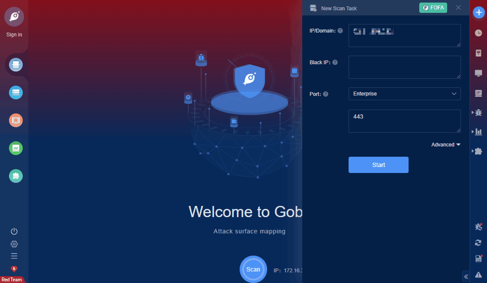

# Apache Tapestry RCE (CVE-2021-27850)

A critical unauthenticated remote code execution vulnerability was found all recent versions of Apache Tapestry. The affected versions include 5.4.5, 5.5.0, 5.6.2 and 5.7.0. The vulnerability I have found is a bypass of the fix for CVE-2019-0195. Recap: Before the fix of CVE-2019-0195 it was possible to download arbitrary class files from the classpath by providing a crafted asset file URL. An attacker was able to download the file AppModule.class by requesting the URL http://localhost:8080/assets/something/services/AppModule.class which contains a HMAC secret key. The fix for that bug was a blacklist filter that checks if the URL ends with .class, .properties or .xml. Bypass: Unfortunately, the blacklist solution can simply be bypassed by appending a / at the end of the URL: http://localhost:8080/assets/something/services/AppModule.class/ The slash is stripped after the blacklist check and the file AppModule.class is loaded into the response. This class usually contains the HMAC secret key which is used to sign serialized Java objects. With the knowledge of that key an attacker can sign a Java gadget chain that leads to RCE (e.g. CommonsBeanUtils1 from ysoserial). Solution for this vulnerability: * For Apache Tapestry 5.4.0 to 5.6.1, upgrade to 5.6.2 or later. * For Apache Tapestry 5.7.0, upgrade to 5.7.1 or later.

**FOFAquery rule**: [icon_hash="820942821" || body="tapestry5/require.js"](https://fofa.so/result?qbase64=aWNvbl9oYXNoPSI4MjA5NDI4MjEiIHx8IGJvZHk9InRhcGVzdHJ5NS9yZXF1aXJlLmpzIg%3D%3D)

# Demo

